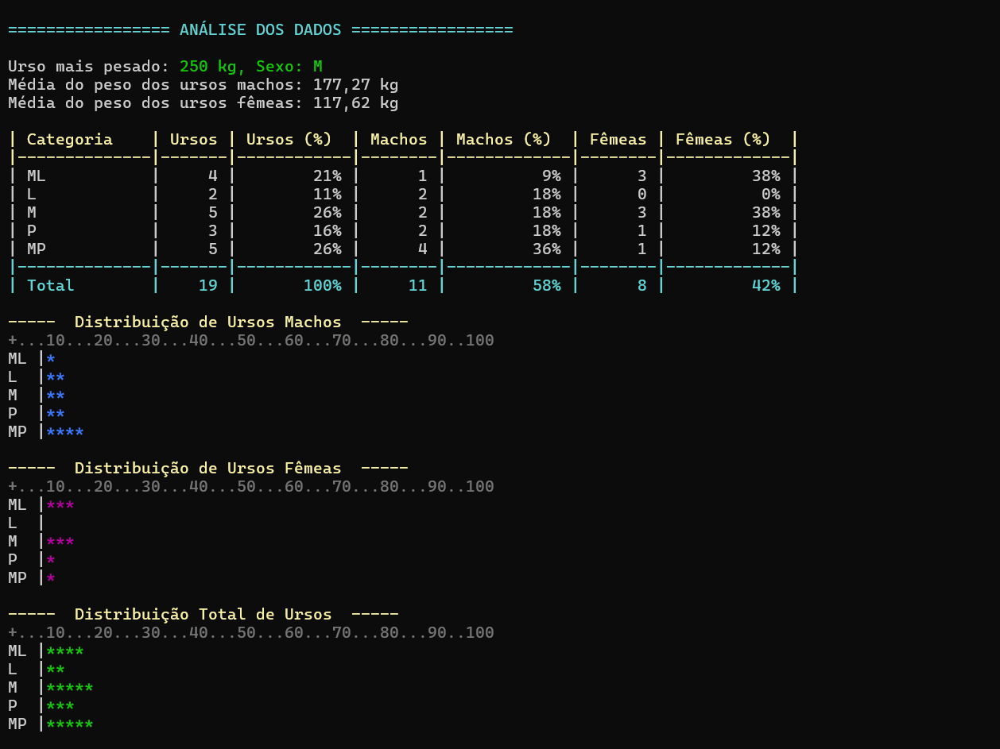

## Exercício `Ursos`

### 📖 Visão Geral do Projeto

Este programa permite que o usuário insira dados sobre ursos individuais, incluindo seu peso e sexo. Após a inserção dos dados, o sistema realiza uma análise estatística completa, calculando o urso mais pesado, a média de peso por sexo e a distribuição dos ursos em categorias de peso pré-definidas. Todos os resultados são apresentados no terminal.

### _Scrennshot_




### _Donwload_

Baixe o arquivo abaixo. Descompacte na pasta desejada.

[📁 Download de arquivo .zip](dist/ursos.zip)

Execute utilizando o comando: 
```
dotnet ursos.dll
```

Ou, se você estiver no Windows, pode dar um duplo-clique no ícone do programa.
